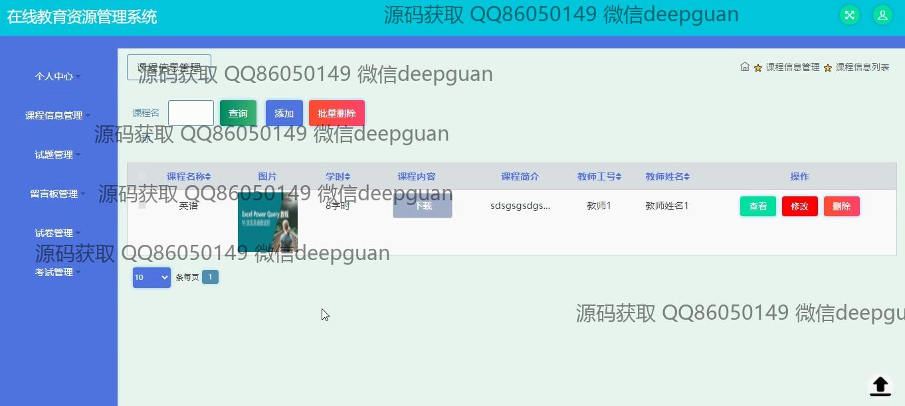
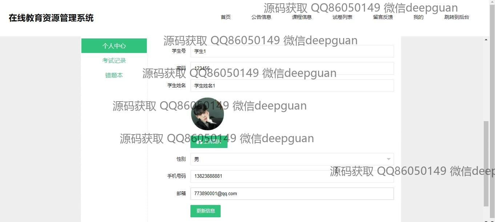

<h1 align="center">的在线课程教育资源考试管理系统</h1>

## 简介
在线课程教育资源考试管理系统：角色分为学生和教师；功能包括用户登录、课程信息管理、试题管理、试卷管理、考试管理、留言板管理与个人中心。界面设计简洁现代，便于操作。    --计算机毕业设计源码；毕设源码；java毕业设计源码

## 联系方式

<h3 align="center">获取完整代码与数据库文件 + 微信：deepguan QQ: 86050149 QQ群: 783742310</h3>

<h3 align="center">可帮忙远程部署 包运行成功！提供远程部署、修改代码、设计文档指导、代码讲解等服务！</h3>

## 功能介绍（完整见运行截图）
学生：基本功能包括在线注册和登录，访问和管理个人中心查看考试记录和错题本，进行课程信息查看，通过留言板提交反馈。可参与考试，通过选择课程查看课程信息详情，下载课程内容。

教师：功能包括在系统中注册和登录，进入个人中心后可以管理课程信息和试题，参与考试管理，批量添加或删除课程，查看学生留言反馈。教师也可以编辑和管理试卷和考试题目，包括答案和分数设置，查看和维护个人信息。

管理员：作为管理员，可进行教师和学生账号管理，系统后台的操作包括查看和修改所有用户的个人信息和账户权限；管理课程信息、试题和试卷等教育资源；通过留言板管理用户反馈，提供一站式在线教育管理，提高系统的整体运行效率。

## 运行截图

本代码来源于网络,仅供学习参考使用!

